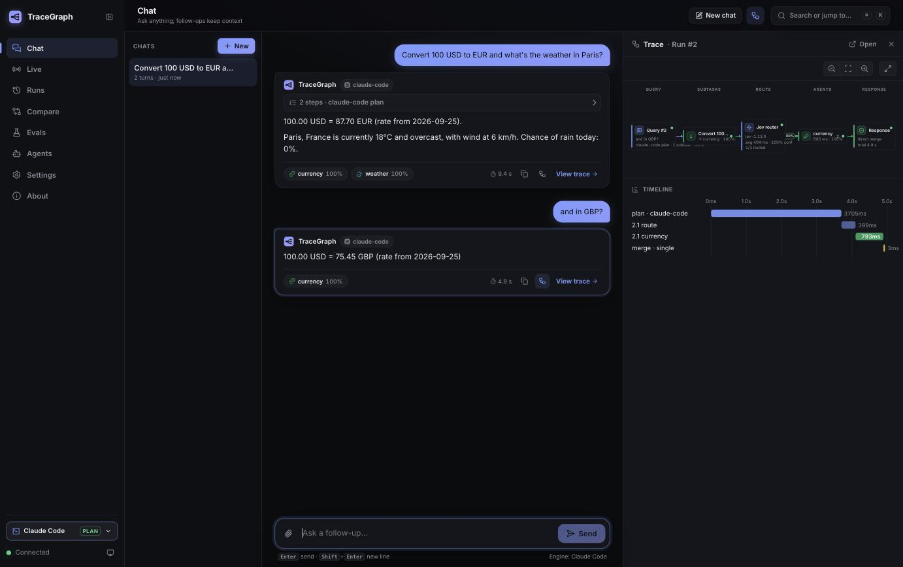
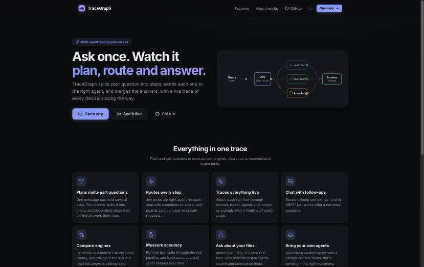
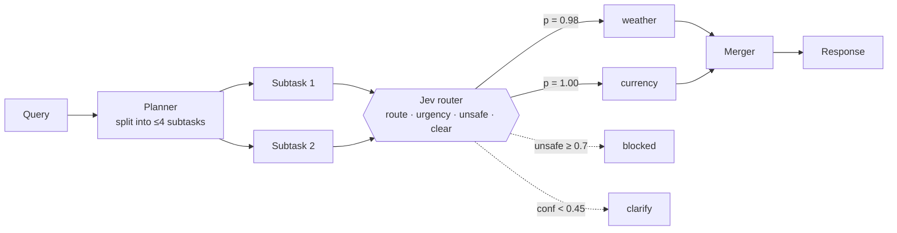
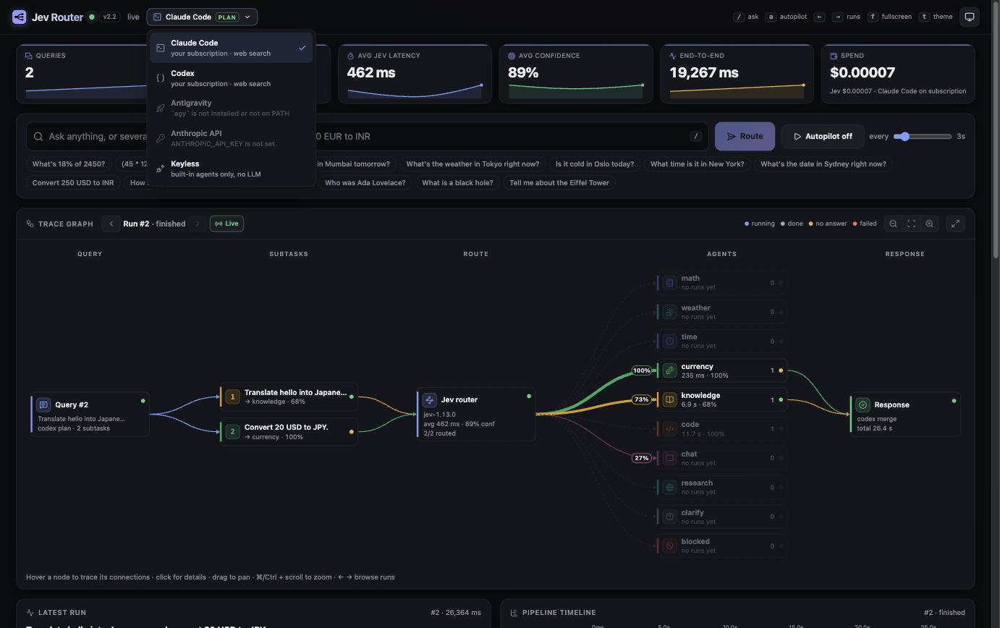

# TraceGraph

**Live multi-agent query routing, visualized as a trace graph.**

Type any question, or several at once. TraceGraph splits it into subtasks. The [Jev](https://docs.typesafe.ai) classifier routes each subtask to the right specialist agent, the agents run in parallel, and the answers are merged. A live dashboard shows every step as it happens.


## Why

Routing is the part of an agent system that is hardest to see. TraceGraph makes it visible. For every decision you see what Jev picked, how sure it was (a probability for every agent, not just the winner), how long each stage took, and whether the chosen agent actually answered.

## Features

- **One router call per subtask.** Jev's `system_one` answers four questions at once: *which agent*, *how urgent*, *is it unsafe*, and *is it clear enough*. Guard rules turn those answers into `blocked` or `clarify` outcomes.
- **Multi-agent chains.** "Weather in Paris **and** convert 100 EUR to INR" becomes two subtasks, routed and run in parallel, then merged into one answer.
- **Keyless by default.** The built-in agents call free public APIs: math (a safe evaluator), weather (Open-Meteo), time zones, currency (Frankfurter), knowledge (DuckDuckGo/Wikipedia abstracts), code (Stack Overflow), and chat.
- **Bring your own LLM subscription.** The planner, the code/knowledge/chat agents, a web-search `research` agent and the merger can run on **Claude Code**, **Codex** or **Antigravity** (your existing plan, no API key), or on the Anthropic API. You can switch engines live from the header. The default, **Auto**, tries Claude Code → Codex → Antigravity → Anthropic API in the order you set (header menu or `TG_ENGINE_ORDER`), moves on to the next when one is out of quota, logged out or timing out, and skips a failed engine for 10 minutes. CLI processes are started ahead of time, so a call only waits for the model. If every engine fails, the agent falls back to its keyless version.
- **Live trace graph.** A fixed five-column layout (Query → Subtasks → Route → Agents → Response) with:
  - node cards showing live metrics and status
  - edges whose width follows Jev's probability
  - animation only on edges that are doing work right now
  - hover to trace a node's connections, click for details
  - ‹ › to replay any recent run
- **Analytics:** a pipeline waterfall, a routing-probability heatmap, a traffic donut, confidence and latency charts, KPI cards with sparklines, and a routing log.
- **Autopilot:** streams sample queries so the dashboard keeps moving during a demo.

### The app

- **Chat with follow-ups.** Sessions keep context, so "and in GBP?" works after a currency question. Answers stream in, with agent chips and a live trace panel.
- **Dependent steps.** "Find the 2022 World Cup winner, then the time in its capital": later steps wait for earlier answers and get them as context.
- **Files.** Attach TXT, MD, CSV, JSON or PDF. The `document` agent searches passages and the `data` agent computes table statistics.
- **Heavy agents.** `report` writes sourced long-form reports. `run` writes and executes code inside Codex's OS sandbox, and only appears when Codex is the engine.
- **Custom agents.** Describe a specialist and give it a prompt; Jev starts routing to it immediately.
- **Compare engines.** One question sent to Claude Code, Codex, Antigravity or the API, with the answers side by side.
- **Evals.** A 40-case suite built from real failure modes, run through the actual pipeline, with accuracy, silent-wrong answers and a history trend.
- **Saved history.** Runs, chats, files, agents and eval results are stored in SQLite and survive restarts. Every run has a shareable `#/runs/:id` page with Answer, Trace, Timeline, Subtasks and Raw tabs.
- **Run control.** A Stop button, per-run deadlines, and a CLI child process that is killed on cancel.
- **Everywhere.** ⌘K command palette, light and dark themes, and a mobile layout with a bottom tab bar.

<table>
  <tr>
    <td></td>
    <td></td>
  </tr>
  <tr>
    <td align="center"><sub>Chat with follow-ups and live trace</sub></td>
    <td align="center"><sub>Landing page</sub></td>
  </tr>
</table>

<table>
  <tr>
    <td></td>
    <td></td>
  </tr>
  <tr>
    <td align="center"><sub>Overview (light theme)</sub></td>
    <td align="center"><sub>Routing heatmap, traffic, confidence, latency</sub></td>
  </tr>
</table>

## How it works



1. **Plan.** The keyless planner splits on conjunctions only when Jev's `multi` check agrees (≥ 0.5). With an LLM key, the model plans the split instead.
2. **Route.** Each subtask gets one Jev call. If `unsafe ≥ 0.7`, the outcome is **blocked**. If confidence is below 0.45 or the query isn't clear, the outcome is **clarify**. Otherwise the subtask goes to the top-scoring agent.
3. **Run.** Agents run concurrently and stream partial output.
4. **Merge.** A single subtask passes straight through. Several are joined, or summarized by the LLM when a key is set.

The server streams every step to the browser over Server-Sent Events. The full event protocol is specified in [`PLAN.md`](PLAN.md).

## Quick start

Requirements: Python 3.10+, Node 20+, and a [TypeSafe](https://typesafe.ai) API key for Jev.

```bash
git clone https://github.com/ayushap18/tracegraph.git
cd tracegraph

# backend
python3 -m venv .venv
.venv/bin/pip install -r requirements.txt
cp .env.example .env          # then set TYPESAFE_API_KEY

# frontend
cd web && npm install && npm run build && cd ..

# run
.venv/bin/python server.py    # http://localhost:8777
```

Hot-reload frontend development: run the server, then `cd web && npm run dev`. Vite proxies the API to `:8777`. You can also work on the UI without a backend or key: `npm run mock` replays a scripted event stream.

### Configuration

| Variable | Required | Purpose |
|---|---|---|
| `TYPESAFE_API_KEY` | yes | Jev routing model |
| `TG_ENGINE` | no | `auto` (default), `claude-code`, `codex`, `agy`, `anthropic` or `none` |
| `ANTHROPIC_API_KEY` | no | Enables the `anthropic` engine (pay per token) |
| `TG_ENGINE_TIMEOUT` | no | Seconds before an engine call is killed, default `180` |
| `TG_ENGINE_CONCURRENCY` | no | Parallel calls per engine, default `2` (protects plan rate limits) |
| `TG_CLAUDE_CODE_MODEL` / `TG_CODEX_MODEL` / `TG_AGY_MODEL` | no | Pin a model for that CLI |
| `PORT` | no | Server port, default `8777` |

Keys are read from the environment or a `.env` file next to `server.py`. `.env` is git-ignored.

### LLM engines: use your subscription



TraceGraph runs the official CLI of each tool as a headless child process on **your own login**. Usage counts against that plan, just as if you ran the CLI yourself. TraceGraph never reads or copies their credentials.

| Engine | Plan | Setup | Headless call |
|---|---|---|---|
| **Claude Code** | Claude Pro / Max | install [Claude Code](https://docs.claude.com/en/docs/claude-code), run `claude` once to sign in | `claude -p --output-format stream-json` |
| **Codex** | ChatGPT Plus / Pro | install the [Codex CLI](https://github.com/openai/codex), run `codex login` | `codex exec --json` |
| **Antigravity** | Google account | `curl -fsSL https://antigravity.google/cli/install.sh \| bash`, run `agy` once to sign in | `agy -p --output-format stream-json` ([headless docs](https://antigravity.google/docs/cli/headless/)) |
| **Anthropic API** | pay per token | set `ANTHROPIC_API_KEY` | Anthropic SDK |

With `TG_ENGINE=auto`, the first installed CLI wins, in the order Claude Code → Codex → Antigravity → API key. With none of them, TraceGraph runs keyless. The server prints what it found at startup.

Each call is isolated:
- It runs in an empty scratch directory with a scrubbed environment: the Jev key is never passed on, and API keys are removed so the CLI stays on your plan.
- It has a deadline and is killed with its whole process group if it overruns or you cancel.
- Calls per engine are capped to respect plan rate limits.
- Claude Code runs without tools, MCP servers or settings unless a call needs web search. That keeps each call to a few hundred tokens instead of about 100K.

### Keyboard shortcuts

`/` focus the ask box · `a` autopilot · `←` `→` browse runs · `l` back to live · `f` fullscreen graph · `t` theme · `Esc` close details

## Project layout

```
server.py                 entry point
jevrouter/
  config.py               agents, thresholds, samples, env loading
  jev.py                  Jev questions and guard rules
  planner.py              heuristic and LLM planners
  pipeline.py             plan → route → run → merge, event emission
  merger.py               single / concat / LLM merge
  agents/tools.py         keyless agents
  agents/llm.py           LLM agents (engine-agnostic) with streaming and fallback
  engines/                claude-code, codex, agy (CLI subprocess runner) and anthropic API engines
  app.py                  aiohttp routes, SSE, static files
tests/                    pytest suite (parsers, planner, pipeline, LLM paths with fakes, HTTP)
web/                      React + TypeScript + D3 dashboard (Vite)
PLAN.md                   design notes and the SSE protocol
```

## Tests

```bash
.venv/bin/pip install -r requirements-dev.txt
.venv/bin/pytest -q           # 155 tests
.venv/bin/python -m jevrouter.evals --engine none   # routing/answer eval suite
cd web && npm run build       # strict TypeScript check + production build
```

The LLM code paths are tested against a fake API client and fake `claude`/`codex`/`agy` binaries that emit each CLI's real event format, so the suite needs no logins, keys or network.

## Tech stack

Python · aiohttp · TypeSafe Jev · Claude Code / Codex / Antigravity CLIs or Anthropic SDK (optional) · React 18 · TypeScript · D3 v7 · Lucide icons · Vite · Server-Sent Events · pytest
