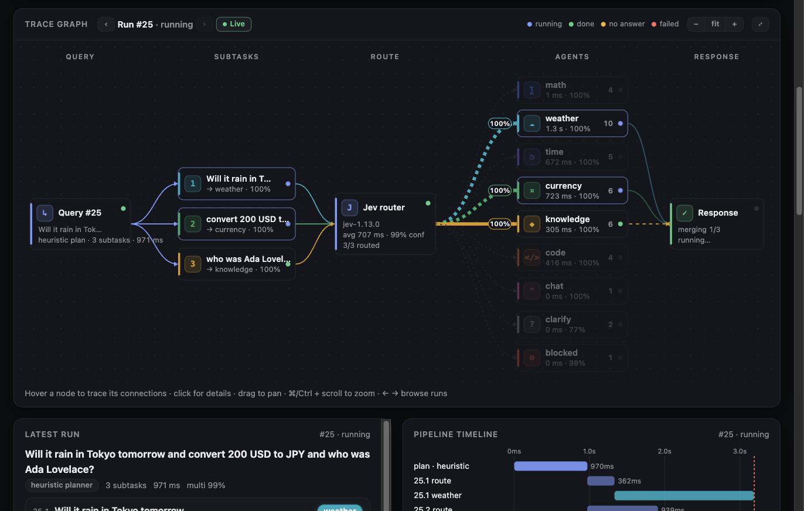
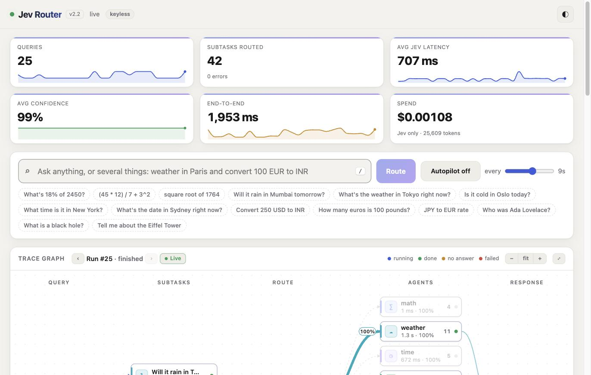
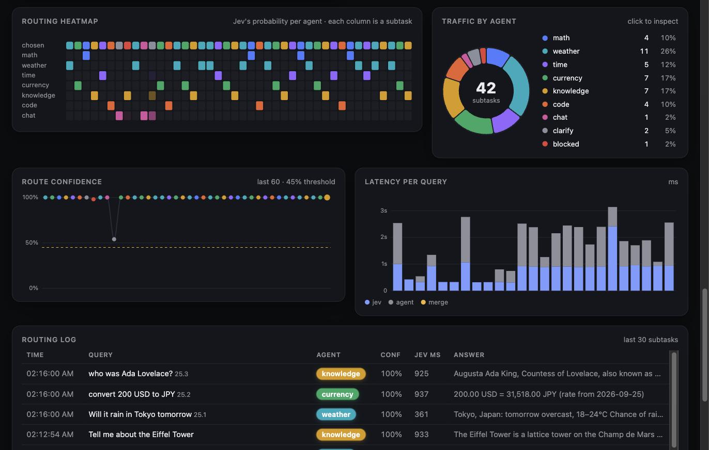
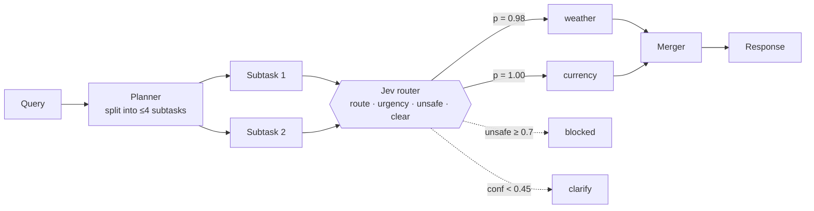

# TraceGraph

**Live multi-agent query routing, visualized as a trace graph.**

Type any question, or several at once. TraceGraph splits it into subtasks. The [Jev](https://docs.typesafe.ai) classifier routes each subtask to the right specialist agent, the agents run in parallel, and the answers are merged. A live dashboard shows every step as it happens.



## Why

Routing is the part of an agent system that is hardest to see. TraceGraph makes it visible. For every decision you see what Jev picked, how sure it was (a probability for every agent, not just the winner), how long each stage took, and whether the chosen agent actually answered.

## Features

- **One router call per subtask.** Jev's `system_one` answers four questions at once: *which agent*, *how urgent*, *is it unsafe*, and *is it clear enough*. Guard rules turn those answers into `blocked` or `clarify` outcomes.
- **Multi-agent chains.** "Weather in Paris **and** convert 100 EUR to INR" becomes two subtasks, routed and run in parallel, then merged into one answer.
- **Keyless by default.** The built-in agents call free public APIs: math (a safe evaluator), weather (Open-Meteo), time zones, currency (Frankfurter), knowledge (DuckDuckGo/Wikipedia abstracts), code (Stack Overflow), and chat.
- **Optional LLM agents.** Set `ANTHROPIC_API_KEY` and the planner, the code/knowledge/chat agents, a web-search `research` agent and the merger switch to a hosted LLM with streamed answers. If a call fails, the agent falls back to its keyless version.
- **Live trace graph.** A fixed five-column layout (Query → Subtasks → Route → Agents → Response) with:
  - node cards showing live metrics and status
  - edges whose width follows Jev's probability
  - animation only on edges that are doing work right now
  - hover to trace a node's connections, click for details
  - ‹ › to replay any recent run
- **Analytics:** a pipeline waterfall, a routing-probability heatmap, a traffic donut, confidence and latency charts, KPI cards with sparklines, and a routing log.
- **Autopilot:** streams sample queries so the dashboard keeps moving during a demo.

<table>
  <tr>
    <td></td>
    <td></td>
  </tr>
  <tr>
    <td align="center"><sub>Overview (light theme)</sub></td>
    <td align="center"><sub>Routing heatmap, traffic, confidence, latency</sub></td>
  </tr>
</table>

## How it works



1. **Plan.** The keyless planner splits on conjunctions only when Jev's `multi` check agrees (≥ 0.5). With an LLM key, the model plans the split instead.
2. **Route.** Each subtask gets one Jev call. If `unsafe ≥ 0.7`, the outcome is **blocked**. If confidence is below 0.45 or the query isn't clear, the outcome is **clarify**. Otherwise the subtask goes to the top-scoring agent.
3. **Run.** Agents run concurrently and stream partial output.
4. **Merge.** A single subtask passes straight through. Several are joined, or summarized by the LLM when a key is set.

The server streams every step to the browser over Server-Sent Events. The full event protocol is specified in [`PLAN.md`](PLAN.md).

## Quick start

Requirements: Python 3.10+, Node 20+, and a [TypeSafe](https://typesafe.ai) API key for Jev.

```bash
git clone https://github.com/ayushap18/tracegraph.git
cd tracegraph

# backend
python3 -m venv .venv
.venv/bin/pip install -r requirements.txt
cp .env.example .env          # then set TYPESAFE_API_KEY

# frontend
cd web && npm install && npm run build && cd ..

# run
.venv/bin/python server.py    # http://localhost:8777
```

Hot-reload frontend development: run the server, then `cd web && npm run dev`. Vite proxies the API to `:8777`. You can also work on the UI without a backend or key: `npm run mock` replays a scripted event stream.

### Configuration

| Variable | Required | Purpose |
|---|---|---|
| `TYPESAFE_API_KEY` | yes | Jev routing model |
| `ANTHROPIC_API_KEY` | no | LLM planner, agents and merger |
| `PORT` | no | Server port, default `8777` |

Keys are read from the environment or a `.env` file next to `server.py`. `.env` is git-ignored.

### Keyboard shortcuts

`/` focus the ask box · `a` autopilot · `←` `→` browse runs · `l` back to live · `f` fullscreen graph · `t` theme · `Esc` close details

## Project layout

```
server.py                 entry point
jevrouter/
  config.py               agents, thresholds, samples, env loading
  jev.py                  Jev questions and guard rules
  planner.py              heuristic and LLM planners
  pipeline.py             plan → route → run → merge, event emission
  merger.py               single / concat / LLM merge
  agents/tools.py         keyless agents
  agents/claude.py        LLM agents with streaming and fallback
  app.py                  aiohttp routes, SSE, static files
tests/                    pytest suite (parsers, planner, pipeline, LLM paths with fakes, HTTP)
web/                      React + TypeScript + D3 dashboard (Vite)
PLAN.md                   design notes and the SSE protocol
```

## Tests

```bash
.venv/bin/pip install -r requirements-dev.txt
.venv/bin/pytest -q           # 85 tests
cd web && npm run build       # strict TypeScript check + production build
```

The LLM code paths are tested against a fake client, so the suite needs no API keys and makes no network calls.

## Tech stack

Python · aiohttp · TypeSafe Jev · Anthropic SDK (optional) · React 18 · TypeScript · D3 v7 · Vite · Server-Sent Events · pytest
